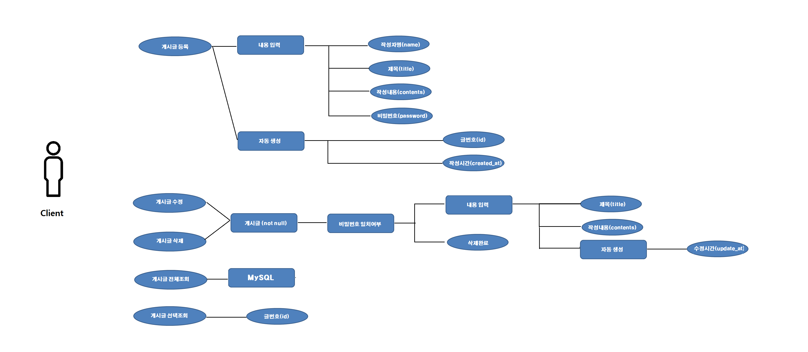
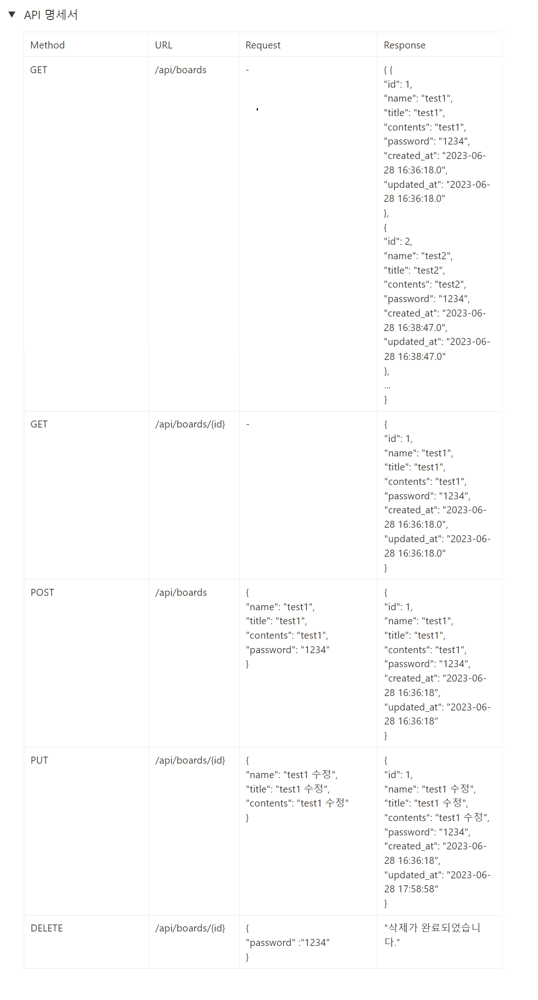

<h1> 게시판 서버 구현하기 </h1>

<h2> Use Case </h2>

  <h2>데이터 테이블 </h2>

CREATE TABLE board
 (
 id BIGINT NOT NULL AUTO_INCREMENT,
 name VARCHAR(20) NOT NULL,
 title VARCHAR(255) NOT NULL,
 contents VARCHAR(500) NOT NULL,
 password VARCHAR(50) NOT NULL,
 created_at DATETIME DEFAULT CURRENT_TIMESTAMP,
 updated_at TIMESTAMP DEFAULT CURRENT_TIMESTAMP ON UPDATE CURRENT_TIMESTAMP,
 PRIMARY KEY (id)
 );

 
<h2>API 명세서 <h2>

* 참고
    .html파일은 추후 적용하고 싶어서 미리 구조만 만든 상태로 기능구현은 없음